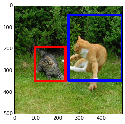
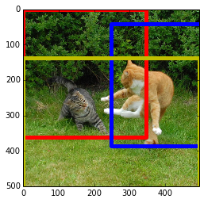

Running Windowed Detection with Caffe
=====================================

[View this page as an IPython Notebook](http://nbviewer.ipython.org/url/caffe.berkeleyvision.org/selective_search_demo.ipynb) (highly recommended!)

---

This approach follows ideas described in Ross Girshick, Jeff Donahue, Trevor
Darrell, Jitendra Malik. *Rich feature hierarchies for accurate object detection
and semantic segmentation*. [Arxiv 2013](http://arxiv.org/abs/1311.2524).

First of all, we'll need a little [Python
script](https://github.com/sergeyk/selective_search_ijcv_with_python) to run the
Matlab Selective Search code.

Let's run detection on an image of a couple of cats frolicking (one of the
ImageNet detection challenge pictures), which we will download from the web.
You'll need a prototxt specifying the network, and a trained model.

We will use `examples/imagenet_deploy.prototxt` and the [caffe_reference_imagene
t_model](https://www.dropbox.com/s/n3jups0gr7uj0dv/caffe_reference_imagenet_mode
l).
You'll need to download the model for yourself, and put it in
`examples/caffe_reference_imagenet_model`.

    !mkdir _temp
    !curl http://farm1.static.flickr.com/220/512450093_7717fb8ce8.jpg > _temp/cat.jpg
    !echo `pwd`/_temp/cat.jpg > _temp/cat.txt
    !python ../python/caffe/detection/detector.py --crop_mode=selective_search --pretrained_model=caffe_reference_imagenet_model --model_def=imagenet_deploy.prototxt _temp/cat.txt _temp/cat.h5

Running this outputs a DataFrame with the filenames, selected windows, and their
ImageNet scores to an HDF5 file.
(We only ran on one image, so the filenames will all be the same.)

    import pandas as pd

    df = pd.read_hdf('_temp/cat.h5', 'df')
    print(df.shape)
    print(df.iloc[0])

    (223, 5)
    feat    [6.90396e-06, 1.27811e-06, 1.82159e-06, 1.1020...
    ymin                                                    0
    xmin                                                    0
    ymax                                                  500
    xmax                                                  496
    Name: /Users/karayev/work/caffe-bvlc/examples/_temp/cat.jpg, dtype: object

In general, `detector.py` is most efficient when running on a lot of images: it
first extracts window proposals for all of them, batches the windows for
efficient GPU processing, and then outputs the results.
Simply list an image per line in the `images_file`, and it will process all of
them.

Although this guide gives an example of ImageNet detection, `detector.py` is
clever enough to adapt to different Caffe models’ input dimensions, batch size,
and output categories.
Refer to `python detector.py --help` and the `images_dim` and `images_mean_file`
parameters to describe your data set.
No need for hardcoding.

Anyway, let's now load ImageNet class names and make a DataFrame of the
features.

    with open('../python/caffe/imagenet/ilsvrc_2012_synset_words.txt') as f:
        labels_df = pd.DataFrame([
            {
                'synset_id': l.strip().split(' ')[0],
                'name': ' '.join(l.strip().split(' ')[1:]).split(',')[0]
            }
            for l in f.readlines()
        ])
    labels_df.sort('synset_id')
    feats_df = pd.DataFrame(np.vstack(df.feat.values), columns=labels_df['name'])
    print(feats_df.iloc[0])

    name
    tench                0.000007
    goldfish             0.000001
    great white shark    0.000002
    tiger shark          0.000001
    hammerhead           0.000007
    electric ray         0.000004
    stingray             0.000007
    cock                 0.000060
    hen                  0.003055
    ostrich              0.000010
    brambling            0.000004
    goldfinch            0.000001
    house finch          0.000004
    junco                0.000002
    indigo bunting       0.000001
    ...
    daisy                    0.000002
    yellow lady's slipper    0.000002
    corn                     0.000020
    acorn                    0.000011
    hip                      0.000003
    buckeye                  0.000010
    coral fungus             0.000005
    agaric                   0.000019
    gyromitra                0.000039
    stinkhorn                0.000002
    earthstar                0.000025
    hen-of-the-woods         0.000035
    bolete                   0.000037
    ear                      0.000008
    toilet tissue            0.000019
    Name: 0, Length: 1000, dtype: float32

Let's look at the activations.

    gray()
    matshow(feats_df.values)
    xlabel('Classes')
    ylabel('Windows')

    <matplotlib.text.Text at 0x107290150>

    <matplotlib.figure.Figure at 0x106877510>

Now let's take max across all windows and plot the top classes.

    max_s = feats_df.max(0)
    max_s.sort(ascending=False)
    print(max_s[:10])

    name
    proboscis monkey       0.923392
    tiger cat              0.918685
    milk can               0.783663
    American black bear    0.637560
    broccoli               0.612832
    tiger                  0.515798
    platypus               0.514660
    dhole                  0.509583
    lion                   0.496187
    dingo                  0.482885
    dtype: float32

Okay, there are indeed cats in there (and some nonsense).
Picking good localizations is work in progress; manually, we see that the third
and thirteenth top detections correspond to the two cats.

    # Find, print, and display max detection.
    window_order = pd.Series(feats_df.values.max(1)).order(ascending=False)

    i = window_order.index[3]
    j = window_order.index[13]

    # Show top predictions for top detection.
    f = pd.Series(df['feat'].iloc[i], index=labels_df['name'])
    print('Top detection:')
    print(f.order(ascending=False)[:5])
    print('')

    # Show top predictions for 10th top detection.
    f = pd.Series(df['feat'].iloc[j], index=labels_df['name'])
    print('10th detection:')
    print(f.order(ascending=False)[:5])

    # Show top detection in red, 10th top detection in blue.
    im = imread('_temp/cat.jpg')
    imshow(im)
    currentAxis = plt.gca()

    det = df.iloc[i]
    coords = (det['xmin'], det['ymin']), det['xmax'] - det['xmin'], det['ymax'] - det['ymin']
    currentAxis.add_patch(Rectangle(*coords, fill=False, edgecolor='r', linewidth=5))

    det = df.iloc[j]
    coords = (det['xmin'], det['ymin']), det['xmax'] - det['xmin'], det['ymax'] - det['ymin']
    currentAxis.add_patch(Rectangle(*coords, fill=False, edgecolor='b', linewidth=5))

    Top detection:
    name
    tiger cat       0.882021
    tiger           0.075015
    tabby           0.024404
    lynx            0.012947
    Egyptian cat    0.004409
    dtype: float32

    10th detection:
    name
    tiger cat           0.681169
    Pembroke            0.063924
    dingo               0.050501
    golden retriever    0.027614
    tabby               0.021413
    dtype: float32

    <matplotlib.patches.Rectangle at 0x108516c90>

That's cool. Both of these detections are tiger cats. Let's take all 'tiger cat'
detections and NMS them to get rid of overlapping windows.

    def nms_detections(dets, overlap=0.5):
        """
        Non-maximum suppression: Greedily select high-scoring detections and
        skip detections that are significantly covered by a previously
        selected detection.

        This version is translated from Matlab code by Tomasz Malisiewicz,
        who sped up Pedro Felzenszwalb's code.

        Parameters
        ----------
        dets: ndarray
            each row is ['xmin', 'ymin', 'xmax', 'ymax', 'score']
        overlap: float
            minimum overlap ratio (0.5 default)

        Output
        ------
        dets: ndarray
            remaining after suppression.
        """
        if np.shape(dets)[0] < 1:
            return dets

        x1 = dets[:, 0]
        y1 = dets[:, 1]
        x2 = dets[:, 2]
        y2 = dets[:, 3]

        w = x2 - x1
        h = y2 - y1
        area = w * h

        s = dets[:, 4]
        ind = np.argsort(s)

        pick = []
        counter = 0
        while len(ind) > 0:
            last = len(ind) - 1
            i = ind[last]
            pick.append(i)
            counter += 1

            xx1 = np.maximum(x1[i], x1[ind[:last]])
            yy1 = np.maximum(y1[i], y1[ind[:last]])
            xx2 = np.minimum(x2[i], x2[ind[:last]])
            yy2 = np.minimum(y2[i], y2[ind[:last]])

            w = np.maximum(0., xx2 - xx1 + 1)
            h = np.maximum(0., yy2 - yy1 + 1)

            o = w * h / area[ind[:last]]

            to_delete = np.concatenate(
                (np.nonzero(o > overlap)[0], np.array([last])))
            ind = np.delete(ind, to_delete)

        return dets[pick, :]

    scores = feats_df['tiger cat']
    windows = df[['xmin', 'ymin', 'xmax', 'ymax']].values
    dets = np.hstack((windows, scores[:, np.newaxis]))
    nms_dets = nms_detections(dets)

Show top 3 NMS'd detections for 'tiger cat' in the image.

    imshow(im)
    currentAxis = plt.gca()
    colors = ['r', 'b', 'y']
    for c, det in zip(colors, nms_dets[:3]):
        currentAxis.add_patch(
            Rectangle((det[0], det[1]), det[2], det[3],
            fill=False, edgecolor=c, linewidth=5)
        )

Remove the temp directory to clean up.

    import shutil
    shutil.rmtree('_temp')

