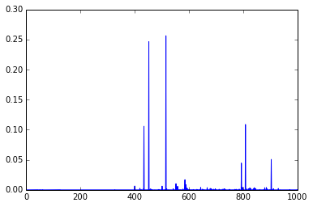

Running Pretrained ImageNet: the Easy way
=========================================

[View this page as an IPython Notebook](http://nbviewer.ipython.org/url/daggerfs.com/caffe/imagenet_pretrained_files/imagenet_pretrained.ipynb)

For easier use of pretrained models, we provide a wrapper specifically written
for the case of ImageNet, so one can take an image and directly compute features
or predictions from them. Both Python and Matlab wrappers are provided. We will
describe the use of the Python wrapper here, and the Matlab wrapper usage is
very similar.

We assume that you have successfully compiled Caffe and set the correct
`PYTHONPATH`. If not, please refer to the [installation
instructions](installation.html). You will use our pre-trained imagenet model,
which you can [download
here](https://www.dropbox.com/sh/854ufsssbqadhvr/t7zgt1meni) (232.57MB).

Ready? Let's start.

    from caffe import imagenet
    from matplotlib import pyplot
    
    # Set the right path to your model file, pretrained model,
    # and the image you would like to classify.
    MODEL_FILE = 'examples/imagenet_deploy.prototxt'
    PRETRAINED = '/home/jiayq/Downloads/caffe_reference_imagenet_model'
    IMAGE_FILE = '/home/jiayq/lena.png'

Loading a network is easy. imagenet.ImagenetClassifier wraps everything. In
default, the classifier will crop the center and corners of an image, as well as
their mirrored versions, thus creating a batch of 10 images. If you look at the
provided MODEL_FILE you can actually see that we are defining the input batch
size to be 10.

If you would like to just do the center, you need to specify center_only=1, and
also change the batch size from 10 to 1 in the prototxt.

    net = imagenet.ImageNetClassifier(
        MODEL_FILE, PRETRAINED)

We will set the phase to test since we are doing testing, and will first use CPU
for the computation.

    net.caffenet.set_phase_test()
    net.caffenet.set_mode_cpu()

So now, we can do a prediction. Let's show some output as well:

    prediction = net.predict(IMAGE_FILE)
    print 'prediction shape:', prediction.shape
    pyplot.plot(prediction)

    prediction shape: (1000,)
    [<matplotlib.lines.Line2D at 0x8faf4d0>]

You can see that the prediction is 1000-dimensional, and is pretty sparse. Our
pretrained model uses the alphabetical order for the synsets, and if you look at
the index that maximizes the prediction score, it is "sombrero". Reasonable
prediction, right?

Now, why don't we see how long it takes to perform the classification end to
end? This result is run from an Intel i5 CPU, so you may observe some
performance differences.

    %timeit net.predict(IMAGE_FILE)

    1 loops, best of 3: 194 ms per loop

It may look a little slow, but note that it also includes image loading,
cropping, and python interfacing time, and it is running 10 images. As a
performance notice, if you really want to make prediction fast, you can
optionally write things in C and also pipeline the image loading part. But for
most applications, the current speed might be fine I guess?

OK, so how about GPU? it is actually pretty easy:

    net.caffenet.set_mode_gpu()

Voila! Now we are in GPU mode. Let's see if the code gives the same result:

    prediction = net.predict(IMAGE_FILE)
    print 'prediction shape:', prediction.shape
    pyplot.plot(prediction)

    prediction shape: (1000,)
    [<matplotlib.lines.Line2D at 0xee00e90>]

Good, everything is the same. And how about time consumption? The following
benchmark is obtained on the same machine with a K20 GPU:

    %timeit net.predict(IMAGE_FILE)

    10 loops, best of 3: 50 ms per loop

Pretty fast right? Not as fast as you expected? Indeed, in this python demo you
are seeing only 4 times speedup. But remember - the GPU code is actually very
fast, and the data loading, transformation and interfacing actually start to
take **more** time than the actual convnet computation itself!

To fully utilize the power of GPUs, you really want to use one of these ideas:
* Use larger batches, and minimize python call and data transfer overheads.
* Pipeline data load operations, like using a subprocess.
* Code in C++. A little inconvenient, but maybe worth it if your dataset is
really, really large.

Parting Words
-------------

So this is python! We hope the interface is easy enough for one to use. The
python wrapper is interfaced with boost::python, and source code can be found at
`python/caffe/imagenet`. If you would like to achieve some custom functions, you
are more than welcome to look at them!
